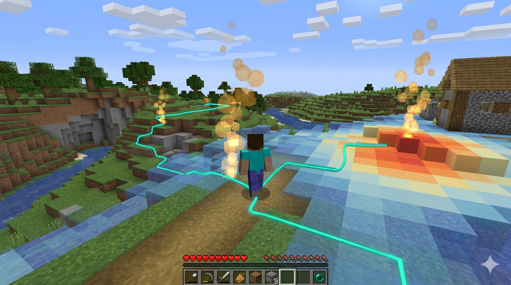

# Group Project Milestone 6: Minecraft MDP, Final Model Selection & Final Report

## Introduction

**Important: All work for this milestone should be on the `main` branch.**

In this milestone you will complete two objectives. First, you will implement a Markov Decision Process (MDP) agent that operates in a live Minecraft environment, connecting the probabilistic reasoning you have built throughout the quarter to sequential decision-making under uncertainty. Second, you will consolidate all three of your models (Bayesian Network, Hidden Markov Model, and MDP) into a single, polished final report suitable for a professional portfolio.

This is your **final submission**. There is no subsequent revision period. Your report should be complete, well-structured, and written for a broad technical audience.



---

## Overview

In this milestone, you will:

- Implement a model-based MDP agent in Minecraft using the provided framework
- Define a state representation, reward function, and terminal condition for your agent
- Train your agent using Value Iteration and/or Policy Iteration on a learned transition model
- Evaluate your agent's learned policy and compare it against a baseline
- Consolidate your BN, HMM, and MDP work into one final report in `README.md`

The **MDP is the core deliverable** for this milestone and carries the majority of the points. Your BN and HMM sections are included to make the final report complete and cohesive; they should be polished and well-presented, but the grading weight is on the MDP implementation, results, and analysis.

You may also:

- Return to your Bayesian Network or HMM and improve its metrics from earlier milestones
- Propose structural or parametric improvements to any of your three models

---

## Git Instructions

Continue working on the `main` branch.

Your `main` branch must contain:

- Your MDP implementation (the core of this milestone)
- Your HMM implementation (from Milestone 5)
- Your BN implementation (from Milestone 4)
- A clean, structured `README.md` containing your final report (see structure below)
- Clean, documented code for each model (notebooks, scripts, or linked snippets)

---

## Part A: Minecraft MDP Agent

### Background

A Markov Decision Process formalizes sequential decision-making under uncertainty. Unlike your Bayesian Network (which encodes static conditional dependencies) and your HMM (which models latent sequential patterns from observed data), an MDP introduces **actions**: your agent actively chooses what to do, and the environment responds stochastically. The agent's objective is to learn a policy that maximizes expected cumulative reward.

In this project, your MDP agent operates inside a live Minecraft server. The agent interacts with the world through a REST API: it observes a discretized state, selects an action, receives a reward, and transitions to a new state. The transition dynamics are **unknown**; your agent must learn the transition model T(s, a, s') from experience, then solve for an optimal policy using Value Iteration or Policy Iteration. This is model-based reinforcement learning, not Q-learning.

### Connection to Course Content

| Concept | Where You Used It |
|---|---|
| Conditional probability, CPTs, MLE | BN (Milestone 4): estimating P(X \| Parents) from frequency counts |
| Latent variables, EM algorithm | HMM (Milestone 5): estimating hidden state parameters from observations |
| Transition matrices | HMM (Milestone 5): state-to-state transition probabilities A |
| Bellman equation, Value/Policy Iteration | MDP (this milestone): solving for optimal policy given learned T |

The transition matrix you learn in the MDP is structurally identical to the HMM transition matrix; both encode P(next state | current state). The difference is that in the MDP, transitions are conditioned on the agent's chosen action, and the agent uses the learned model to plan rather than merely decode.

### What You Will Implement

You will work in three files inside the `student/` directory:

1. **`mdp_definition.py`**: Define your MDP.
   - `state_fn(raw_state) -> tuple`: Discretize the raw observation into a hashable state tuple. This is your state representation. Choose features that are relevant to your agent's task (position, tool tier, health, nearby resources, etc.). Keep it tabular-friendly; every additional dimension multiplies your state space.
   - `reward_fn(old_state, action, new_state) -> float`: Assign a scalar reward. This encodes your agent's objective. Positive rewards for progress (crafting tools, collecting resources, advancing the tech tree), negative rewards for danger or waste, zero for neutral actions.
   - `terminal_fn(state, step_count) -> bool`: Define when an episode ends. Common choices: a fixed step limit, reaching a goal state, or detecting that the agent is stuck.

2. **`mdp_agent.py`**: Implement the planning algorithms.
   - `value_iteration(S, A, T, R, gamma, theta)`: Iterate the Bellman optimality equation until the value function converges (max change < theta).
   - `policy_iteration(S, A, T, R, gamma)`: Alternate between policy evaluation and policy improvement until the policy stabilizes.
   - The exploration/exploitation loop: your agent must balance exploring new (state, action) pairs to build the transition model against exploiting the current best policy.

3. **`agent.py`**: The `TransitionMatrix` class is provided. It maintains count-based estimates of T(s, a, s') and updates them online as the agent acts. You do not need to modify this file, but you should understand how it works.

### Running Your Agent

Your agent connects to the Minecraft bridge server via the API. You will be provided an API key and server URL. To run:

```bash
MDP_API_KEY=<your_key> MDP_SERVER_URL=https://tile.ucsd.edu python -m student.mdp_agent
```

The agent will:
1. Fetch the available actions from the bridge (`GET /actions`)
2. Observe the current state (`GET /raw_state`)
3. Select an action (epsilon-greedy over the current policy)
4. Execute the action (`POST /action`)
5. Observe the resulting state and compute the reward
6. Update the transition model and periodically re-solve for the optimal policy
7. Repeat

### Design Decisions You Must Make

**State representation.** The raw observation from the bridge contains dozens of fields (position, health, food, inventory, nearby blocks, tool tier, etc.). You must choose which subset to include in your state tuple and how to discretize continuous values. A smaller state space converges faster but may lose important distinctions. A larger state space is more expressive but requires exponentially more data to learn. Document your choices and justify them.

**Reward shaping.** Your reward function defines what "good behavior" means. If rewards are too sparse (only rewarding a distant goal), the agent may never discover them through random exploration. If rewards are too dense (rewarding every micro-action), the agent may get trapped in local optima. Think carefully about what intermediate milestones deserve reward and what behaviors deserve penalty.

**Exploration strategy.** Your agent uses epsilon-greedy exploration: with probability epsilon it takes a random action, otherwise it follows the current policy. You must choose an initial epsilon, a decay schedule, and a minimum epsilon floor. Too much exploration wastes time on random actions; too little exploration means the agent never discovers better strategies.

**Discount factor (gamma).** This controls how much the agent values future rewards versus immediate rewards. A gamma close to 1.0 makes the agent far-sighted; a gamma close to 0 makes it myopic. For Minecraft, where tool-crafting payoffs are many steps away from the initial wood-gathering actions, a gamma of 0.95-0.99 is typical.

### What to Report for the MDP

In your final report (Section 3.3 and Section 5), include:

- Your state representation: which features, how discretized, the resulting state-space size
- Your reward function: what behaviors are rewarded/penalized and by how much
- Your terminal condition and episode structure
- The planning algorithm(s) you used (VI, PI, or both) and their convergence behavior
- A learning curve: cumulative reward per episode over time
- The number of episodes, states discovered, and transitions learned
- A qualitative description of what your agent learned to do (e.g., "the agent learned to gather wood, craft a pickaxe, and mine stone before exploring caves")
- A comparison to a baseline (e.g., random policy, or the agent's performance in the first N episodes vs. the last N episodes)
- Limitations: what your agent struggles with and why (e.g., deaths resetting inventory, sparse rewards for distant goals, state space too large for certain features)

---

## Part B: Final Report Structure

Your final report lives in `README.md` on the `main` branch. It must cover all three models (BN, HMM, MDP) in a unified document. Structure it as follows. Think of this as a technical report you would include in a professional portfolio or share with a recruiter: clear, well-organized, and demonstrating both your technical depth and your ability to communicate results.

---

### 1. Introduction (2 pts)

This section sets the stage for your entire project. Write it for someone who has not taken this course.

- **Problem statement.** What real-world or theoretical problem are you solving? Why does it matter?
- **Why probabilistic modeling?** Why is reasoning under uncertainty important for this problem? What are the limitations of deterministic or non-probabilistic approaches?
- **PEAS analysis.** Describe your agent in terms of:
  - **P**erformance measure: how you evaluate success
  - **E**nvironment: what the agent operates in (your dataset's domain, the Minecraft world, etc.)
  - **A**ctuators: what actions the agent can take (predictions, classifications, Minecraft actions)
  - **S**ensors: what the agent observes (features, raw state, observations)
- **Project overview.** Briefly preview the three modeling approaches you will present (BN, HMM, MDP) and how they connect to each other and to the problem.

---

### 2. Dataset & Preprocessing (3 pts)

- Dataset source, size, and key features
- Task definition: what are you predicting, classifying, or optimizing?
- Data types (categorical, continuous, mixed)
- Preprocessing steps: cleaning, handling missing values, discretization, feature engineering, temporal ordering (if applicable for HMM), state-space design (for MDP)
- Justification for your design decisions: why these features, why this discretization, why this ordering?

For the MDP component, describe the Minecraft observation space, which features you selected for your state tuple, and how you discretized them.

---

### 3. Methods (12 pts)

Organize this section into three subsections, one per model. For each, describe the model, your implementation, and how you improved it. **Do not include results here;** save those for Section 5. The MDP subsection (3.3) carries the most weight.

#### 3.1 Bayesian Network (BN)

- Formal description of your BN structure (include a DAG diagram)
- Which variables are nodes? What are the edges and why?
- How you estimated parameters (CPTs via MLE, Laplace smoothing, etc.)
- Independence and conditional independence assumptions
- Inference procedure (variable elimination, exact enumeration, etc.)
- What you improved from Milestone 4 and why (structural changes, additional variables, better discretization, etc.)

#### 3.2 Hidden Markov Model (HMM)

- Formal description: state space, observation space, initial distribution pi, transition matrix A, emission matrix B
- How you identified the latent variable(s) and justified the temporal ordering
- Parameter estimation via EM (describe the E-step and M-step)
- Inference method used (Forward, Viterbi, etc.) and why
- Connection to your BN: which BN nodes became hidden states vs. observations?
- What you improved from Milestone 5 and why

#### 3.3 Markov Decision Process (MDP)

- Formal description: state space S, action space A, transition model T(s,a,s'), reward function R, discount factor gamma
- Your state representation: which features, discretization scheme, state-space size
- Your reward function: what behaviors are incentivized and why
- Planning algorithm(s): Value Iteration and/or Policy Iteration
  - Include the Bellman equation you are solving
  - Convergence criteria (theta threshold)
- Exploration strategy: epsilon-greedy schedule, decay rate, minimum floor
- How the transition model is learned online from experience
- Connection to earlier models: how the MDP transition matrix relates to the HMM transition matrix conceptually

For each subsection, include:
- A diagram or figure illustrating the model structure
- Key formulas (no need to re-derive from scratch; state them and explain what each term means)
- Assumptions and simplifications you made
- Technically grounded improvements you implemented or propose, based on structure, parameter estimation, preprocessing, or identified weaknesses

---

### 4. Training & Implementation (5 pts)

- Training procedure for each model:
  - BN: how CPTs were populated, train/test split
  - HMM: EM iterations, convergence criteria, number of hidden states tested
  - MDP: number of episodes, epsilon schedule, replan frequency, runtime
- Hyperparameters and how you chose them
- Link to clean, documented code for each model (or include key snippets)
- If using libraries (pgmpy, hmmlearn, gymnasium, etc.), explain what each library does and cite it

---

### 5. Results & Discussion (11 pts)

Present results for all three models, then compare them. Organize as follows. The MDP results (5.3) carry the most weight: this is where you demonstrate what your agent learned and how well your design decisions paid off.

#### 5.1 Bayesian Network Results

- Quantitative metrics (accuracy, F1, log-likelihood, etc.)
- Baseline comparison (e.g., random guessing, majority class)
- Key visualizations (confusion matrix, heatmap, CPT tables, etc.)
- Interpretation: where does the model perform well? Where does it fail? Why?

#### 5.2 Hidden Markov Model Results

- Quantitative metrics (log-likelihood, decoded state accuracy vs. ground truth if available, etc.)
- Comparison to the BN: what does the HMM capture that the BN does not?
- Key visualizations (decoded state sequence, emission distributions, etc.)
- Interpretation: how well does the temporal structure help?

#### 5.3 MDP Results

- Learning curve (cumulative reward per episode over training)
- Number of states discovered, transitions learned, episodes completed
- Policy behavior: what does the agent do? Describe qualitatively and quantitatively.
- Baseline comparison (random policy vs. learned policy)
- Key visualizations (learning curve plot, policy summary, state visitation heatmap if applicable)
- Interpretation: what did the agent learn? Where does it struggle?

#### 5.4 Cross-Model Comparison

- **Summary table** comparing all three models on their respective tasks and metrics
- What does each model capture that the others do not?
- Key assumptions and trade-offs across the three approaches
- Which is your strongest model overall, and why? Justify both empirically (metrics) and conceptually (what it represents about the problem)

#### 5.5 Limitations & Future Work

- Weaknesses or failure modes of each model
- Concrete, technically grounded proposals for improvement (do not write "use more data"; be specific about what structural, parametric, or preprocessing change would help and why)
- Potential extensions: what would you try with more time?

---

### 6. Conclusion (2 pts)

- Summarize what you built across the three milestones
- State your strongest model and the key evidence supporting that choice
- Reflect on what you learned: what do your results suggest about the role of probabilistic reasoning and uncertainty modeling in your problem domain?
- When is your probabilistic approach especially valuable, and when might it struggle?
- End with a concise final statement on your key takeaway from the project

---

### 7. Statement of Collaboration (Required)

Describe each group member's contributions to this milestone and to the project overall. Be specific (e.g., "Alice implemented the HMM EM algorithm and wrote Section 3.2; Bob designed the MDP reward function and ran the Minecraft experiments; Carol built the BN and created all visualizations").

---

### 8. Citations & AI Disclosure (Required)

Cite:

- All libraries used (pgmpy, hmmlearn, gymnasium, mineflayer, numpy, matplotlib, etc.)
- External resources (papers, tutorials, documentation)
- Any generative AI tools used in the process (ChatGPT, Claude, Copilot, etc.)

For each AI tool, briefly describe how it was used (e.g., "used ChatGPT to debug an indexing error in our EM implementation" or "used Claude to help structure the reward function").

Failure to cite may result in point deductions. You will not be penalized for using these tools, only for failing to disclose them.

---

## Point Breakdown

| Section | Points |
|---|---|
| 1. Introduction | 2 |
| 2. Dataset & Preprocessing | 3 |
| 3. Methods (BN + HMM + **MDP**) | 12 |
| 4. Training & Implementation | 5 |
| 5. Results & Discussion (MDP-heavy) | 11 |
| 6. Conclusion | 2 |
| **Total** | **35** |

> **Grading emphasis:** The MDP implementation and analysis is the primary focus of this milestone. Points in Sections 3 and 5 are weighted toward your MDP work (state design, reward function, planning algorithms, learning curves, policy analysis). Your BN and HMM subsections are graded on completeness and polish; they round out the report but are not the main evaluation target.

### Additional Notes

- Your report should read as a **single cohesive document**, not three stapled-together milestones. Use consistent formatting, consistent terminology, and cross-reference between sections where appropriate (e.g., "As shown in our BN results (Section 5.1), the conditional independence assumptions do not hold for features X and Y. The HMM addresses this by...").
- Write for a technical audience that has not taken this course. Avoid unexplained jargon. A well-written report doubles as a portfolio piece.
- Include figures and tables where they help. A confusion matrix, a learning curve, a DAG diagram, and a decoded state sequence plot are worth more than paragraphs of description.
- Code should be clean and documented. Link to specific notebooks or files in your repository rather than pasting walls of code into the README.

**This milestone is worth: 35 points of 100 total project points**
